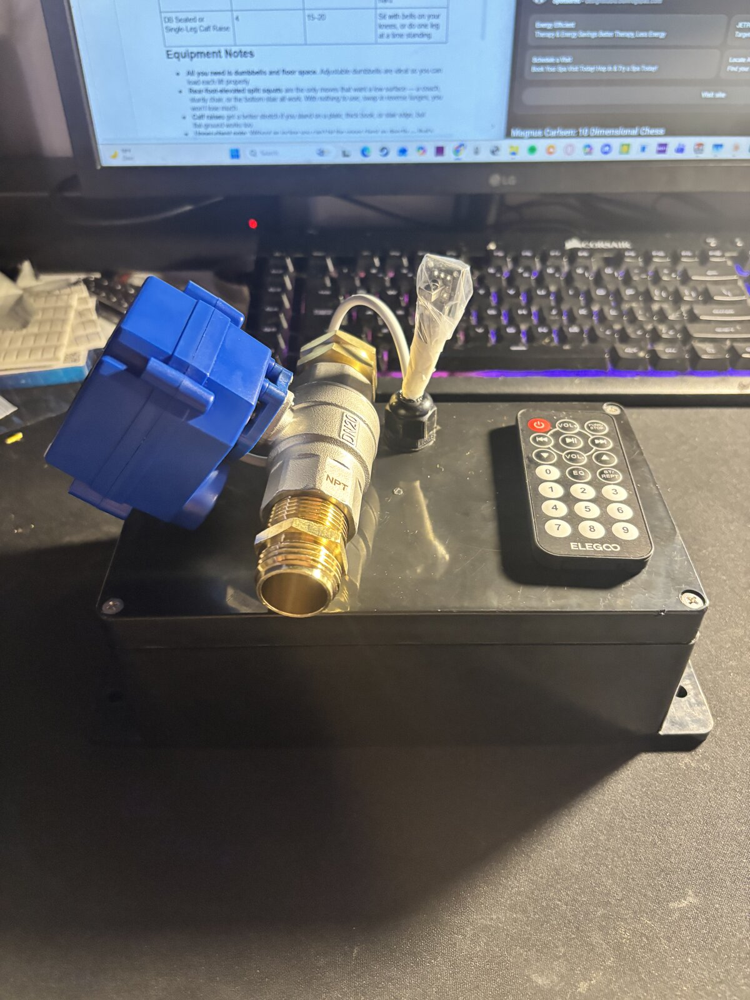
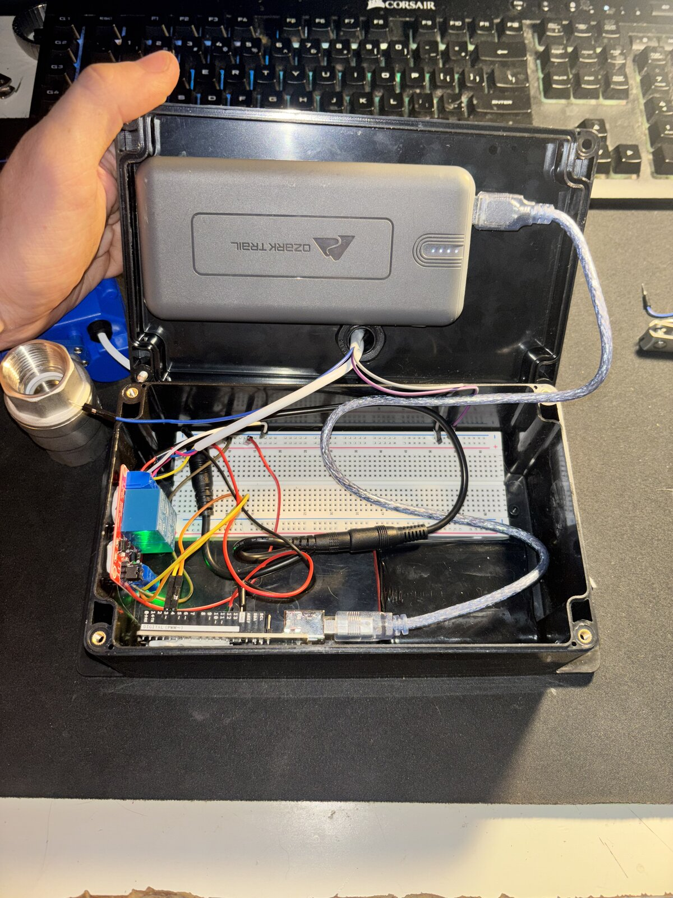

# IR-Controlled Motorized Valve Controller

An embedded control system that actuates a 12V motorized ball valve from an IR remote. An Arduino UNO decodes commands from a 38 kHz IR receiver and drives a relay stage that switches the valve's open/close motor lines — 5V logic controlling a 12V inductive load. Built as a remote-controlled irrigation valve, packaged in a weather-resistant enclosure.

## How it works

The system is a signal chain from remote to motor:

1. **IR acquisition** — the remote transmits commands on a modulated 38 kHz infrared carrier. The receiver module demodulates the carrier and outputs a logic-level pulse train.
2. **Decoding (firmware)** — the IRremote library decodes the pulse train; the sketch matches the received command byte against the OPEN (0x0C) and CLOSE (0x18) buttons.
3. **Repeat filtering** — IR remotes retransmit while a button is held. The firmware tracks the last received raw code and ignores repeats, so one press produces exactly one actuation.
4. **Relay stage** — a matched command pulses a GPIO-driven relay channel for 5 seconds, long enough for the valve motor to complete its travel. One channel drives the valve's OPEN line, the other drives CLOSE.
5. **The load** — the "valve" is really a geared DC motor (US Solid 3-wire motorized ball valve): a common ground plus separate 12V open/close drive lines, switched through the relay contacts.

## Hardware

| Part | Role |
|---|---|
| Arduino UNO | Decoding + control logic |
| IR receiver module + remote | Command input (38 kHz carrier) |
| Relay module | 5V logic to 12V power interface |
| US Solid 12V motorized ball valve | Actuated load (geared DC motor, 3-wire) |
| USB power bank | Logic-side supply |
| 12V supply | Valve motor supply |
| Project enclosure + cable gland | Weather-resistant packaging |

Two separate voltage domains (5V logic, 12V motor) share a common ground reference — required so the relay control signals and the switched load agree on what "low" means.

## Firmware

Single sketch: [`ir_valve_controller/ir_valve_controller.ino`](ir_valve_controller/ir_valve_controller.ino)

- `IrReceiver.decode()` polls for a completed IR frame each loop pass
- Command bytes are compared against the mapped OPEN/CLOSE buttons
- A matched command drives the corresponding relay pin for a 5-second actuation window, then releases it
- Raw-code comparison suppresses held-button repeat frames
- Serial output at 9600 baud for debugging received codes

## Demo

28-second demo of the valve cycling open and closed from the remote: `demo.mp4` in this repo.

## Build photos

Enclosure internals — Arduino, relay stage, breadboard distribution, and power bank, with the valve panel-mounted through the lid:

More photos in [`photos/`](photos/).

## What I learned debugging this

- **Relay trigger polarity is not universal.** Relay modules differ between active-high and active-low trigger conventions, and a channel that "doesn't fire" is often just the opposite convention from what the code assumes. I verified the behavior of my module directly before trusting the firmware logic.
- **Shared ground is non-negotiable.** With two supplies in the system, the logic side and the motor side must share a ground reference, or the relay control signals float.
- **IR remotes are noisier than they look.** Between repeat frames and occasional decode glitches, the firmware needs to filter input rather than trust every frame.

## Possible next steps

- Soil-moisture sensing for closed-loop autonomous watering (removes the human from the loop)
- Replace the 5-second fixed actuation window with feedback from the valve's position
- Timer-based scheduling as a fallback when no command is received
